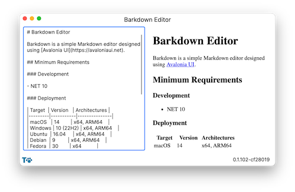

# Barkdown Editor

    

---

Barkdown is a simple Markdown editor designed using [Avalonia UI](https://avaloniaui.net).

## Minimum Requirements

### Development

- NET 10

### Deployment

| Target  | Version   | Architectures |
|---------|-----------|---------------|
| macOS   | 14        | x64, ARM64    |
| Windows | 10 (22H2) | x64, ARM64    |
| Ubuntu  | 16.04     | x64, ARM64    |
| Debian  | 9         | x64, ARM64    |
| Fedora  | 30        | x64           |

## Background

I love using Markdown. Although there are a sea of editors already out there, I created this to be simple enough in its design that I could tinker and extend it to my heart's content. That being said, contributions are very much welcome.

## License

I hereby waive this project's copyright and place it the public domain - see [UNLICENSE](LICENSE) for details.
